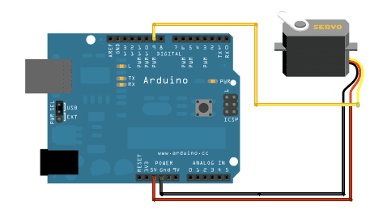

# Servo Motors

## Introduction

During last week's workshop, we learned how to use the GPIO pins on the Arduino. Today, let's study how ot use servo motors. 

## Objective

Sweeps the shaft of a RC servo motor back and forth across 180 degrees.

## Background

The servomotors we work with are rotary actuators that allows for precise control of angular position. It consists of a suitable motor coupled to a sensor for position feedback. It also requires a relatively sophisticated controller, often a dedicated module designed specifically for use with servomotors.

Please note that by definition, servo motors are not a specific class of motor, although the term servomotor is often used to refer to a motor suitable for use in a closed-loop control system.

Servo motors are used in applications such as robotics, CNC machinery or automated manufacturing.

## Circuit

Servo motors have three wires: power, ground, and signal. The power wire is typically red, and should be connected to the 5V pin on the Arduino board. The ground wire is typically black or brown and should be connected to a ground pin on the board. The signal pin is typically yellow, orange or white and should be connected to pin 9 on the board.

## Software Implementation

#### Pulse Width Modulation

Check out our PWM tutorial!
 
#### The Arduino Servo Library

The implementation relies on the Arduino software library called `Servo`. Let's first gain some understanding of the servo library.

This library allows an Arduino board to control RC (hobby) servo motors. Most standard servos allow the shaft to be positioned at various angles, usually between 0 and 180 degrees. Continuous rotation servos allow the rotation of the shaft to be set to various speeds.

#### Implementation

	/* Sweep
	 by BARRAGAN <http://barraganstudio.com>
	 This example code is in the public domain.
	
	 modified 8 Nov 2013
	 by Scott Fitzgerald
	 http://www.arduino.cc/en/Tutorial/Sweep
	*/
	
	#include <Servo.h>
	
	Servo myservo;  // create servo object to control a servo
	// twelve servo objects can be created on most boards
	
	int pos = 0;    // variable to store the servo position
	
	void setup() {
	  myservo.attach(9);  // attaches the servo on pin 9 to the servo object
	}
	
	void loop() {
	  for (pos = 0; pos <= 180; pos += 1) { // goes from 0 degrees to 180 degrees
	    // in steps of 1 degree
	    myservo.write(pos);              // tell servo to go to position in variable 'pos'
	    delay(15);                       // waits 15ms for the servo to reach the position
	  }
	  for (pos = 180; pos >= 0; pos -= 1) { // goes from 180 degrees to 0 degrees
	    myservo.write(pos);              // tell servo to go to position in variable 'pos'
	    delay(15);                       // waits 15ms for the servo to reach the position
	  }
	}

### Extension

The goal for the extension is to control the position of a RC (hobby) servo motor with your Arduino and a potentiometer. The potentiometer should be wired so that its two outer pins are connected to power (+5V) and ground, and its middle pin is connected to analog input 0 on the board. You can learn more about this extension project [here](https://www.arduino.cc/en/Tutorial/Knob).

### Resources

https://howtomechatronics.com/how-it-works/how-servo-motors-work-how-to-control-servos-using-arduino/
