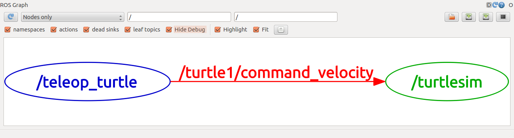

## ROS Nodes

### ROS is a Graph

* `nodes`: A node is an executable that uses ROS to communicate with other nodes.
* `messages`: ROS data type used when subscribing or publishing to a topic.
* `topics`: Nodes can publish messages to a topic as well as subscribe to a topic to receive messages.
* `master`: Name service for ROS (i.e. helps nodes find each other)
* `rosout`: ROS equivalent of stdout/stderr
* `roscore`: Master + rosout + parameter server (parameter server will be introduced later)

A node really isn't much more than an executable file within a ROS package. ROS nodes use a ROS client library to communicate with other nodes. Nodes can publish or subscribe to a Topic. Nodes can also provide or use a Service.

### ROS Core

`roscore` is the first thing you should run when using ROS.

Please run:

	$ roscore

You will see something similar to:

	... logging to ~/.ros/log/9cf88ce4-b14d-11df-8a75-00251148e8cf/roslaunch-machine_name-13039.log
	Checking log directory for disk usage. This may take awhile.
	Press Ctrl-C to interrupt
	Done checking log file disk usage. Usage is <1GB.
	
	started roslaunch server http://machine_name:33919/
	ros_comm version 1.4.7
	
	SUMMARY
	======
	
	PARAMETERS
	 * /rosversion
	 * /rosdistro
	
	NODES
	
	auto-starting new master
	process[master]: started with pid [13054]
	ROS_MASTER_URI=http://machine_name:11311/
	
	setting /run_id to 9cf88ce4-b14d-11df-8a75-00251148e8cf
	process[rosout-1]: started with pid [13067]
	started core service [/rosout]

### Using rosrun
`rosrun` allows you to use the package name to directly run a node within a package (without having to know the package path). In this example, we will experiment with `turtlebot`, a tutorial example built right into ROS.

Usage:

	$ rosrun [package_name] [node_name]
So now we can run the `turtlesim_node` in the turtlesim package.

Then, in a new terminal:

	$ rosrun turtlesim turtlesim_node

In a new terminal:

	$ rosnode list
You will see something similar to:

	/rosout
	/turtlesim

### Review

What was covered:

* roscore = ros+core : master (provides name service for ROS) + rosout (stdout/stderr) + parameter server (parameter server will be introduced later)
* rosnode = ros+node : ROS tool to get information about a node.
* rosrun = ros+run : runs a node from a given package.

Now that you understand how ROS nodes work, let's look at how ROS topics work.

## ROS Topics

Topics are named buses (channels) over which nodes exchange messages. Topics have anonymous publish/subscribe semantics, which decouples the production of information from its consumption. In general, nodes are not aware of who they are communicating with. Instead, nodes that are interested in data subscribe to the relevant topic; nodes that generate data publish to the relevant topic. There can be multiple publishers and subscribers to a topic.

Topics are intended for unidirectional, streaming communication. Nodes that need to perform remote procedure calls, i.e. receive a response to a request, should use services instead. There is also the Parameter Server for maintaining small amounts of state.

### Topic Types
Each topic is **strongly typed** by the ROS message type used to publish to it and nodes can only receive messages with a matching type. The Master does not enforce type consistency among the publishers, but subscribers will not establish message transport unless the types match.

	
### Example Setup

Let's start by making sure that we have roscore running, in a new terminal:

	$ roscore

For this tutorial we will also use turtlesim. Please run in a new terminal:

	$ rosrun turtlesim turtlesim_node

We'll also need something to drive the turtle around with. Please run in a new terminal:

	$ rosrun turtlesim turtle_teleop_key
	[ INFO] 1254264546.878445000: Started node [/teleop_turtle], pid [5528], bound on [aqy], xmlrpc port [43918], tcpros port [55936], logging to [~/ros/ros/log/teleop_turtle_5528.log], using [real] time
	Reading from keyboard
	---------------------------
	Use arrow keys to move the turtle.
	
Now you can use the arrow keys of the keyboard to drive the turtle around. **If you can not drive the turtle select the terminal window of the `turtle_teleop_key` to make sure that the keys that you type are recorded.**

### Visualization
The `turtlesim_node` and the `turtle_teleop_key` node are communicating with each other over a ROS Topic. `turtle_teleop_key` is publishing the key strokes on a topic, while turtlesim subscribes to the same topic to receive the key strokes. Let's use `rqt_graph` which shows the nodes and topics currently running.

In a new terminal:

	$ rosrun rqt_graph rqt_graph

You will see something similar to:

### Introducing rostopic
The rostopic tool allows you to get information about ROS topics.

You can use the help option to get the available sub-commands for rostopic

	$ rostopic -h
	rostopic bw     display bandwidth used by topic
	rostopic echo   print messages to screen
	rostopic hz     display publishing rate of topic    
	rostopic list   print information about active topics
	rostopic pub    publish data to topic
	rostopic type   print topic type
Or pressing tab key after rostopic prints the possible sub-commands:

	$ rostopic 
	bw    echo  find  hz    info  list  pub   type 
Let's use some of these topic sub-commands to examine turtlesim.

### Using rostopic echo
rostopic echo shows the data published on a topic.

Usage:

	rostopic echo [topic]
Let's look at the command velocity data published by the turtle_teleop_key node.

This data is published on the /turtle1/cmd_vel topic. In a new terminal, run:

	$ rostopic echo /turtle1/cmd_vel

You probably won't see anything happen because no data is being published on the topic. Let's make `turtle_teleop_key` publish data by pressing the arrow keys. Remember if the turtle isn't moving you need to select the turtle_teleop_key terminal again.

You should now see the following when you press the up key:

	linear: 
	  x: 2.0
	  y: 0.0
	  z: 0.0
	angular: 
	  x: 0.0
	  y: 0.0
	  z: 0.0
	---
	linear: 
	  x: 2.0
	  y: 0.0
	  z: 0.0
	angular: 
	  x: 0.0
	  y: 0.0
	  z: 0.0
	---
	
### Using rostopic list
rostopic list returns a list of all topics currently subscribed to and published.

Let's figure out what argument the list sub-command needs. In a new terminal run:

	$ rostopic list -h
	Usage: rostopic list [/topic]
	
	Options:
	  -h, --help            show this help message and exit
	  -b BAGFILE, --bag=BAGFILE
	                        list topics in .bag file
	  -v, --verbose         list full details about each topic
	  -p                    list only publishers
	  -s                    list only subscribers
	  
	  
### ROS Messages
Communication on topics happens by sending ROS **messages** between nodes. For the publisher (`turtle_teleop_key`) and subscriber (`turtlesim_node`) to communicate, the publisher and subscriber must send and receive the same type of message. This means that a topic **type** is defined by the message **type** published on it. The **type** of the message sent on a topic can be determined using `rostopic type`.
