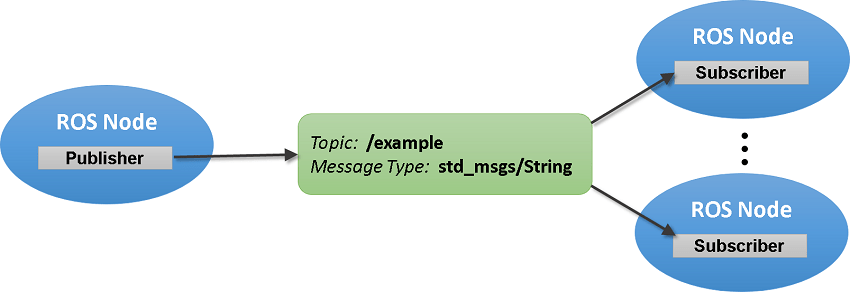

# ROS Publishers and Subscribers

## Data Exchange in ROS

The primary mechanism for ROS nodes to exchange data is sending and receiving messages. Messages are transmitted on a topic, and each topic has a unique name in the ROS network. If a node wants to share information, it uses a publisher to send data to a topic. A node that wants to receive that information uses a subscriber to that same topic. Besides its unique name, each topic also has a message type, which determines the types of messages that are capable of being transmitted under that topic.

This publisher and subscriber communication has the following characteristics:

* Topics are used for many-to-many communication. Many publishers can send messages to the same topic and many subscribers can receive them.
* Publishers and subscribers are decoupled through topics and can be created and destroyed in any order. A message can be published to a topic even if there are no active subscribers.

This diagram above illustrate a simple publisher and subscriber architecture. 

## Writing a Simple Publisher

Let's develop a publisher in Python. Here's the full implementation. 

	#!/usr/bin/env python
	import rospy
	from std_msgs.msg import String
	
	def talker():
	    pub = rospy.Publisher('chatter', String, queue_size=10)
	    rospy.init_node('talker', anonymous=True)
	    rate = rospy.Rate(10) # 10hz
	    while not rospy.is_shutdown():
	        hello_str = "hello world %s" % rospy.get_time()
	        rospy.loginfo(hello_str)
	        pub.publish(hello_str)
	        rate.sleep()
	
	if __name__ == '__main__':
	    try:
	        talker()
	    except rospy.ROSInterruptException:
	        pass

Let's dive into the details.

	pub = rospy.Publisher('chatter', String, queue_size=10)
	rospy.init_node('talker', anonymous=True)

This section of code defines the talker's interface to the rest of ROS. `pub = rospy.Publisher("chatter", String, queue_size=10)` declares that your node is publishing to the chatter topic using the message type String. String here is actually the class `std_msgs.msg.String`. The `queue_size` argument limits the amount of queued messages if any subscriber is not receiving them fast enough.

    while not rospy.is_shutdown():
        hello_str = "hello world %s" % rospy.get_time()
        rospy.loginfo(hello_str)
        pub.publish(hello_str)
        rate.sleep()

This loop is a fairly standard rospy construct: checking the `rospy.is_shutdown() ` flag and then doing work. You have to check `is_shutdown() `to check if your program should exit (e.g. if there is a Ctrl-C or otherwise). In this case, we call `pub.publish(hello_str)` that publishes a string to our chatter topic. The loop calls `rate.sleep()`, which sleeps just long enough to maintain the desired rate through the loop.

## Writing a Simple Subscriber

Let's write a subscriber to listen to the data from the publisher. Let's make a file called `listener.py`, which is a standalone node. The code is straightforward

	#!/usr/bin/env python
	import rospy
	from std_msgs.msg import String
	
	def callback(data):
	    rospy.loginfo(rospy.get_caller_id() + "I heard %s", data.data)
	    
	def listener():
	
	    # In ROS, nodes are uniquely named. If two nodes with the same
	    # name are launched, the previous one is kicked off. The
	    # anonymous=True flag means that rospy will choose a unique
	    # name for our 'listener' node so that multiple listeners can
	    # run simultaneously.
	    rospy.init_node('listener', anonymous=True)
	
	    rospy.Subscriber("chatter", String, callback)
	
	    # spin() simply keeps python from exiting until this node is stopped
	    rospy.spin()
	
	if __name__ == '__main__':
	    listener()

### Callback

The code for `listener.py` is similar to talker.py, except we've introduced a **new callback-based mechanism** for subscribing to messages.

    rospy.init_node('listener', anonymous=True)

    rospy.Subscriber("chatter", String, callback)

    # spin() simply keeps python from exiting until this node is stopped
    rospy.spin()
    
This declares that your node subscribes to the chatter topic which is of type `std_msgs.msgs.String`. When new messages are received, callback is invoked with the message as the first argument.

We also changed up the call to `rospy.init_node()` somewhat. We've added the `anonymous=True` keyword argument. ROS requires that each node have a unique name. If a node with the same name comes up, it bumps the previous one. (purpose: malfunctioning nodes can easily be kicked off). The `anonymous=True` flag tells rospy to generate a unique name for the node so that you can have multiple `listener.py` nodes run easily.

Finally, `rospy.spin()` simply keeps your node from exiting until the node has been shutdown. Unlike `roscpp, rospy.spin()` does not affect the subscriber callback functions, as those have their own threads.

## Some Great tutorials explaining the overall architecture of ROS 
Here are some good readings to understand the overarching concepts of ROS nodes and how they communicate with one another. Please read them to make sure you understand the overall concepts of what you will be implementing later on. We believe all of these links do a really good job of explaining the concepts!

<!--[Overview of ROS Nodes](https://roboticsbackend.com/what-is-a-ros-node/)
-->
[Video Overview of ROS Publishers and Subscribers](https://www.youtube.com/watch?v=bJB9tv4ThV4)

[Good Analogy for ROS Publishers and Subscribers](https://answers.ros.org/question/185205/what-are-publishers-and-subscribers/)

## ROS Tutorial on how to set up a ROS publisher and subscriber

[Tutorial Straight from Open Robotics (The creators of ROS)](http://wiki.ros.org/ROS/Tutorials/WritingPublisherSubscriber%28python%29)

## Challenge!

Here is a quick challenge! Use the following link to figure out how to transmit two different data types!

[Link to standard message datatypes](http://wiki.ros.org/std_msgs)

Good luck! Have fun! Please feel free to reach out to Aniv, Nihar, Neil, or Adi if you have any questions!

