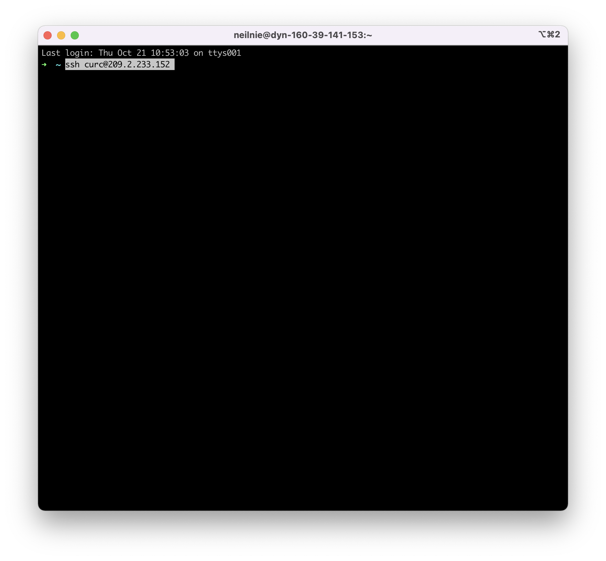

# How to use SSH

### What is SSH

Secure Shell is a cryptographic network protocol for operating network services securely over an unsecured network. Typical applications include remote command-line, login, and remote command execution

By using SSH, we can also reduce some strains on our hardware setup. Since we have a limited amount of ROS desktops at our lab, SSH allows multiple groups to log onto the same computer.

### Step 1

First, open the command line on your computer. Next, you need to find out the IP address of the machine you are intending to use. For example, the ROS desktop's IP is `209.2.233.152`. You can find the currently avaliable IPs on this [Google Doc](https://docs.google.com/document/d/1Oei6aTbX9dWjSIQJyZZjP37XYDNEvWX2ZAnua-SWfhI/edit?usp=sharing). Next, you need to get the username of the ROS desktop, some examples are: `curc-2-u1, curc-2-u2...`. (We will try to assign team members different usernames...). 

Once you have all of that information, you can try to log into the ROS desktop using SSH. 

	ssh curc@209.2.233.152

It will prompt you to enter your password. (Remember universal accounts on each machine should share the same password). Your command line might look something like this.

### Step 2

Now you can begin developing software. The best way to manage your work (which often requires multiple command line windows) without any user interface is to use `tmux`. I would highly recommend you to checkout this `tmux` [tutorial](https://www.hamvocke.com/blog/a-quick-and-easy-guide-to-tmux/).